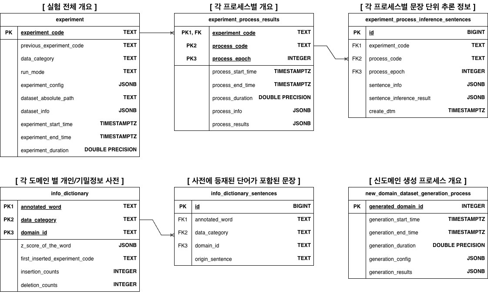

# 🛡️ Sensitive Info Detector
> **BERT 기반 민감정보(개인정보/기밀정보) 탐지 및 마스킹 프로젝트**

## 📋 Table of Contents
- [Project Overview](#-project-overview)
- [Database Schema](#-database-schema-erd)
- [Installation](#-installation)

## 🧐 Project Overview

이 프로젝트는 텍스트 내에 포함된 개인정보(PI Information) & 기업 기밀정보(Confidential Information)를 탐지하여...
(설명 내용)

## 🗂️ Database Schema (ERD)
> 프로젝트에서 사용된 데이터베이스 구조는 아래와 같습니다.

## 📁 Project Structure
> 프로젝트에서 사용된 소스코드 및 파일들의 구조입니다.

sensitive-info-detector/
├── configs/                               # 모든 설정 파일 관리
│   ├── base_config.yaml                   # 기본 설정
│   └── experiment_config.yaml             # 실험별 하이퍼파라미터
│
├── data/                                  # 데이터 저장소
│   ├── zip_raw_data/                      # 도메인별로 관리되는 압축폴더(원본 유지용 & 수정 절대 불가능)
│   │   └── {domain_id}_{domain_name}.zip
│   │
│   └── train_data/                        # 도메인별로 관리되는 폴더(데이터와 정답지 포함 & 필요에 따라 수정 가능)
│       └── {domain_id}_{domain_name}
│           ├── {document_id}.json         # 문서단위 데이터
│           ├── ...                        # 문서단위 데이터
│           └── answer_sheet.csv           # 정답지(단순 추론 대상 도메인이라면 없음)
│
├── outputs/                               # 실험 결과 및 로그
│   ├── checkpoints/                       # 학습 모델 가중치
│   │   └── {experiment_code}_{process_epoch}.pt
│   │
│   └── logs/                              # 실험단위로 관리되는 실험 로그
│       └── {experiment_code}/
│           ├── {experiment_code}_{process_code}_{process_epoch}_inference_sentences.csv  # 각 프로세스에서 문장 단위 추론 결과
│           ├── {experiment_code}_all_process_results.txt                                 # 실험 + 모든 프로세스의 결과를 순서대로 작성한 txt
│           ├── {experiment_code}_loss_graph.png                                          # 모델 학습 중 train & valid loss 추이를 나타낸 그래프
│           ├── {experiment_code}_label_count_graph.png                                   # 모델 학습 중 정탐오탐미탐 샘플 수 추이를 나타낸 그래프
│           └── {experiment_code}_experiment_log.txt                                      # 실험 파이프라인 실행 중 발생하는 모든 print log
│   
├── src/                         # 소스 코드 (Package)
│   ├── __init__.py
│   │
│   ├── database/                # DB 관련 로직 (ERD 기반)
│   │   ├── __init__.py
│   │   ├── config.py            # DB 설정
│   │   ├── connection.py        # DB 연결 및 세션 관리
│   │   ├── models.py            # SQLAlchemy 모델 정의 (Table Schema)
│   │   ├── crud.py              # Insert, Select 등 쿼리 함수 모음
│   │   └── exporter.py          # DB정보 CSV로 추출
│   │
│   ├── models/                  # 모델 아키텍처 (classifier 폴더 대체)
│   │   ├── __init__.py
│   │   ├── span_roberta.py
│   │   └── ner_roberta.py
│   │
│   ├── modules/                 # 각 탐지 로직의 핵심 모듈
│   │   ├── __init__.py
│   │   ├── dictionary_matcher.py # (dictionary_matching)
│   │   ├── ner_matcher.py        # (ner_regex_matching/ner_logics)
│   │   └── regex_matcher.py      # (ner_regex_matching/regex_logics)
│   │
│   ├── pipelines/               # 실행 프로세스 로직 (Process 1~6 대체) -> 여기부터는 내가 좀 진행하면서 수정할수도 있을 것 같으다.
│   │   ├── __init__.py
│   │   ├── preprocessor.py       # 데이터 전처리 및 로드
│   │   ├── trainer.py            # (process_1) 학습 루프
│   │   ├── validator.py          # (process_2, 5) 검증 로직 통합  ----> trainer와 validator를 run_mode에 따라서 분기해서 실행하도록 설정 
│   │   ├── augmenter.py          # (process_6) 데이터 증강
│   │   └── dictionary_updater.py # (update_dictionary.py) 사전 업데이트
│   │
│   ├── utils/                   # 유틸리티
│   │   ├── dataset.py            # PyTorch Dataset 정의
│   │   ├── metrics.py            # 평가 지표 계산
│   │   └── logger.py             # 로깅 설정
│
├── tools/                       # 실행과 별개인 도구들 (labeling_tools)
│   ├── candidate_labeler.py
│   ├── manual_validator.py
│   └── metric_viewer.py
│
├── scripts/                     # 실제 실행 진입점 (Entry Points)
│   ├── init_project.py          # DB 생성 및 초기 사전 구축 (create_dbs + init_dictionary)
│   ├── run_experiment.py        # (run_pipeline.py) 실험 전체 파이프라인 실행
│   └── run_augmentation.py      # 증강만 따로 돌릴 때
│
├── .env                         # DB 접속 정보, 비밀키
├── .gitignore
│
├── README.md
└── requirements.txt