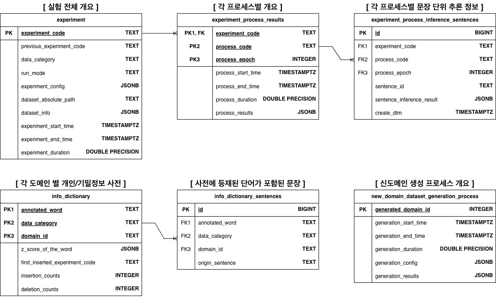

# 🛡️ Sensitive Info Detector


> **BERT 기반 민감정보(개인정보/기밀정보) 탐지 프로젝트**

## 📋 Table of Contents
- [Project Overview](#-project-overview)
- [Development Environment](#-development-environment)
- [Database Schema](#-database-schema-erd)
- [Project Structure](#-project-structure)
- [Installation & Setup](#-installation--setup)
- [Configuration](#-configuration)
- [Usage (Pipeline)](#-usage-pipeline)
- [Outputs](#-outputs)

---

## 🧐 Project Overview
이 프로젝트는 비정형 텍스트 내에 포함된 **개인정보(PII)** 및 **기업 기밀정보(Confidential Info)**를 탐지하기 위해 **Deep Learning(BERT)**과 **Rule-based(Dictionary, Regex)** 방식을 결합한 하이브리드 시스템입니다.

* **이원화된 탐지:** 데이터 성격에 따라 `Personal Data` 모드와 `Confidential Data` 모드로 분리하여 동작합니다.
* **하이브리드 검증:** 규칙 기반 탐지 결과와 모델 추론 결과를 교차 검증하여 **Double Check(신뢰도 향상)** 및 **Complement(누락 방지)**를 수행합니다.
* **실험 관리:** 모든 실험 과정과 결과는 데이터베이스(PostgreSQL)에 기록되며, 상세 로그는 CSV 및 TXT 리포트로 자동 생성됩니다.

<br>

## ⚙️ Development Environment
본 프로젝트는 아래와 같은 **Multi-GPU 환경**에서 학습 및 테스트되었습니다. 대규모 언어 모델(RoBERTa-Large)의 원활한 학습을 위해 **48GB VRAM** 이상의 환경을 권장합니다.

| Component | Specification | Description |
| :--- | :--- | :--- |
| **GPU** | **2ea** x NVIDIA GeForce RTX 3090 | 24GB VRAM per GPU (Total 48GB) |
| **CUDA** | Version 12.1 | PyTorch Compatibility |
| **Database** | PostgreSQL | 실험 로그 및 데이터셋 메타정보 관리 |
| **OS** | Linux (Ubuntu 20.04) | |

<br>

## 🗂️ Database Schema (ERD)
프로젝트의 모든 데이터(실험 설정, 학습 로그, 추론 결과, 사전 데이터)는 아래 ERD 구조에 따라 관리됩니다.



<br>

## 📁 Project Structure
리팩토링된 전체 프로젝트 디렉토리 구조입니다.

```text
sensitive-info-detector/
├── assets/  # 프로젝트 관련 이미지 관리
│
├── configs/
│   ├── base_config.yaml          # 기본 설정을 관리하는 yaml파일 ✅
│   ├── experiment_config.yaml    # 실험별 하이퍼파라미터를 관리하는 파일 ✅
│   └── init_project_config.yaml  # run_init_project.py 설정을 관리하는 파일 ✅
│
├── data/
│   ├── zip_raw_data/  # 도메인별로 관리되는 압축폴더(원본 유지용 & 데이터 수정 절대 불가능)
│   │   └── {domain_id}_{domain_name}.zip ❌
│   │
│   └── train_data/  # 도메인별로 관리되는 폴더(데이터와 정답지 포함 & 필요에 따라 데이터 수정 가능)
│       └── {domain_id}_{domain_name}/
│           ├── {domain_id}_{document_id}.json  # 문서단위 데이터 ❌
│           ├── ...                             # 문서단위 데이터 ❌
│           └── answer_sheet.csv                # 정답지(단순 추론 대상 도메인이라면 없음) ❌
│
├── outputs/  # 실험 결과 및 로그
│   ├── checkpoints/  # 학습 모델 가중치
│   │   └── {experiment_code}/
│   │       └── epoch_{process_epoch}.pt ✅
│   │
│   └── logs/  # 실험단위로 관리되는 실험 로그
│       └── {experiment_code}/
│           ├── {experiment_code}_{process_code}_{process_epoch}_inference_sentences.csv  # 각 프로세스에서 문장 단위 추론 결과 ✅
│           ├── {experiment_code}_all_process_results.txt                                 # 실험 + 모든 프로세스의 결과를 순서대로 작성한 txt ✅
│           ├── {experiment_code}_loss_graph.png                                          # 모델 학습 중 train & valid loss 추이를 나타낸 그래프 ✅
│           ├── {experiment_code}_label_count_graph.png                                   # 모델 학습 중 정탐오탐미탐 샘플 수 추이를 나타낸 그래프 ✅
│           └── {experiment_code}_experiment_log.txt                                      # 실험 파이프라인 실행 중 발생하는 모든 print log ✅
│   
├── src/  # 소스 코드 (Package)
│   ├── database/  # DB 관련 로직 (ERD 기반)
│   │   ├── init_db.py     # DB 초기화 로직 (동일 config DB가 있는 경우에도 안전하게 실행 가능) ✅
│   │   ├── config.py      # DB 접속 정보 및 URL 설정 관리 ✅
│   │   ├── connection.py  # DB 세션(Session) 생명주기 및 연결 관리 ✅
│   │   ├── models.py      # ORM 모델 클래스 및 테이블 스키마 정의 ✅
│   │   └── crud.py        # 데이터 IO(CRUD) 로직 및 타입 변환 (ORM↔Dict) ✅
│   │
│   ├── models/  # 모델 아키텍처
│   │   └── ner_roberta.py ✅
│   │
│   ├── modules/  # 각 탐지 로직의 핵심 모듈
│   │   ├── z_score_calculator.py           # Z-score 계산 모듈 ❌
│   │   ├── confidence_score_calculator.py  # Confidence-score 계산 모듈 ❌
│   │   ├── data_generator.py               # 신도메인 데이터 생성 모듈 ❌
│   │   ├── result_aggregator.py            # 정탐/오탐/미팀 데이터 수집 & 통계 & 포맷팅 모듈 ✅
│   │   ├── ner_preprocessor.py             # [NER모델]데이터 전처리 및 로드 모듈 ✅
│   │   ├── ner_trainer.py                  # [NER모델]학습 모듈 ✅
│   │   ├── ner_evaluator.py                # [NER모델]검증 모듈 ✅
│   │   ├── dictionary_matcher.py           # 사전 매칭 모듈 ✅
│   │   ├── dictionary_updater.py           # 사전 업데이트 모듈 ❌
│   │   ├── regex_matcher.py                # 정규표현식 매칭 모듈 ✅
│   │   └── regex_logics/                   # 정규표현식 매칭 모듈에서 사용하는 로직 ✅
│   │
│   ├── processes/  # 실행 프로세스 
│   │   ├── process_0.py  # Model초기화, Dataset, Dataloader 준비 프로세스 ✅    
│   │   ├── process_1.py  # 모델학습 및 검증 프로세스 ✅        
│   │   ├── process_2.py  # 사전 매칭 검증 프로세스 ✅
│   │   ├── process_3.py  # 정규표현식 매칭 검증 프로세스 ✅    
│   │   ├── process_4.py  # 모델 검증 프로세스(process_2, process_3에서 정탐된 word들과 비교) ✅
│   │   └── process_5.py  # 신도메인 데이터 생성 및 ZIP 저장 프로세스(근데 이거도 module로 가야 할 것 같은데..) ❌
│   │
│   └── utils/  # 유틸리티
│       ├── common.py      # YAML 로드, 시드 고정, 디렉토리 생성 등 공통 함수 🔄
│       ├── logger.py      # 로깅 🔄
│       └── visualizer.py  # 그래프 그리는 친구 🔄
│
├── tools/  # 실행과 별개인 도구들 (labeling_tools)
│   ├── candidate_labeler.py ❌
│   └── metric_viewer.py ❌
│
├── scripts/  # 실제 실행 진입점 (Entry Points)
│   ├── run_init_project.py           # DB 생성 및 초기 사전 구축 ✅
│   ├── run_experiment.py             # 실험 전체 파이프라인 실행 ✅
│   └── run_new_domain_generation.py  # 신도메인 데이터 생성만 따로 돌릴 때 ❌
│
├── .env  # DB 접속 정보, 비밀키 ✅
├── .gitignore ✅
│
├── README.md ✅
└── requirements.txt ✅
```

<br>

## 🛠️ Installation & Setup

### 1. Prerequisites
* `Python 3.8+` 환경이 필요합니다.
* `PostgreSQL 12+` 데이터베이스 서버가 실행 중이어야 합니다.
* `src/database/config.py` (또는 `.env`) 파일에 본인의 DB 접속 정보(`HOST`, `PORT`, `USER`, `PASSWORD`, `DBNAME`)를 올바르게 설정해주세요.

### 2. Install Dependencies
프로젝트 실행에 필요한 파이썬 라이브러리를 설치합니다.
```bash
pip install -r requirements.txt
```

### 3. Database Initialization
프로젝트를 처음 시작하기 전, DB 테이블을 생성하고 초기 정답지 데이터를 구축해야 합니다.
```bash
python scripts/run_init_project.py
```
이 스크립트는 `configs/init_project_config.yaml` 설정을 참조하여 작동합니다. 실행 후 DB에 테이블이 생성되었는지 확인해주세요.

<br>

## ⚙️ Configuration
모든 실험 제어는 `configs/` 폴더 내의 YAML파일을 통해 이루어집니다.

| 파일명 | 역할 및 설명 |
| :--- | :--- |
| **`base_config.yaml`** | **불변 공통 설정**. 데이터/로그 저장 경로, 모델 아키텍처(RoBERTa), 라벨 맵 등 프로젝트 전반에 걸친 고정값을 관리합니다. |
| **`experiment_config.yaml`** | **가변 실험 설정**. 실험 코드를 정의하고, 학습률(LR), 배치 크기, 실행 모드 등을 변경할 때 사용합니다. |

### 주요 설정 옵션 (`experiment_config.yaml`)

* **`data_category`**: 데이터셋 및 모델의 성격을 결정합니다.
    * `"personal_data"`: 개인정보(이름, 전화번호 등) 탐지 모델
    * `"confidential_data"`: 기업 기밀정보 탐지 모델
* **`run_mode`**: 파이프라인 실행 방식을 결정합니다.
    * `"train"`: 데이터셋으로 모델 학습(`process_1`) 수행 후 검증 및 규칙 기반 탐지 진행.
    * `"test"`: 학습 과정을 건너뛰고, 지정된 Checkpoint를 로드하여 추론 및 하이브리드 검증 수행.
* **`run_process_X`**: 각 프로세스(1~4)의 실행 여부를 제어합니다 (`true`/`false`).

<br>

## 🚀 Usage (Pipeline)

전체 파이프라인을 실행합니다. 설정된 `run_mode`에 따라 학습 또는 추론이 자동으로 진행됩니다.

```bash
python scripts/run_experiment.py
```

### Pipeline Workflow
본 프로젝트는 5단계의 순차적인 프로세스로 구성되어 있으며, 각 단계는 모듈화되어 유기적으로 동작합니다.

1.  **Process 0 (Setup):**
    * 데이터셋 로드 및 Train/Valid 자동 분할.
    * 모델 아키텍처 초기화 및 가중치 로드(Resume/Inference).
2.  **Process 1 (Model Train - Deep Learning):**
    * BERT(RoBERTa) 모델 학습 및 검증.
    * 매 Epoch마다 Checkpoint 저장, Loss/F1 Score 기록.
3.  **Process 2 (Dictionary - Rule):**
    * 구축된 사전을 메모리에 로드하여 고속 매칭 수행.
    * **Self-Cleaning:** Train 모드에서 오탐(Wrong) 발생 시, 해당 단어를 사전에서 자동 무효화 처리.
4.  **Process 3 (Regex - Rule):**
    * 정규표현식을 이용한 패턴 매칭(주민번호, 전화번호, 이메일 등) 검증.
5.  **Process 4 (Hybrid Analysis):**
    * 규칙 기반 탐지 결과와 모델 추론 결과를 교차 검증.
    * **Double Check:** 규칙과 모델이 모두 탐지한 경우 (높은 신뢰도).
    * **Model Complement:** 규칙이 놓친 것을 모델이 탐지한 경우 (모델의 효용성 입증).

<br>

## 📊 Outputs

실험이 완료되면 `outputs/logs/{experiment_code}/` 경로에 아래 결과물들이 자동 생성됩니다.

| 파일 유형 | 파일명 | 설명 |
| :--- | :--- | :--- |
| **Report** | `{code}_all_process_results.txt` | 실험 설정, Epoch별 성능, 프로세스별 요약 통계가 담긴 **최종 성적표**. |
| **Log** | `{code}_experiment_log.txt` | 파이프라인 실행 중 발생한 모든 시스템 로그 및 에러 메시지. |
| **Graph** | `{code}_loss_graph.png` | 학습/검증 Loss 변화 추이를 시각화한 그래프. |
| **Data** | `{code}_inference_sentences.csv` | 각 프로세스 및 Epoch별 **문장 단위 상세 추론 결과**. 정탐/오탐/미탐 분석 용도. |